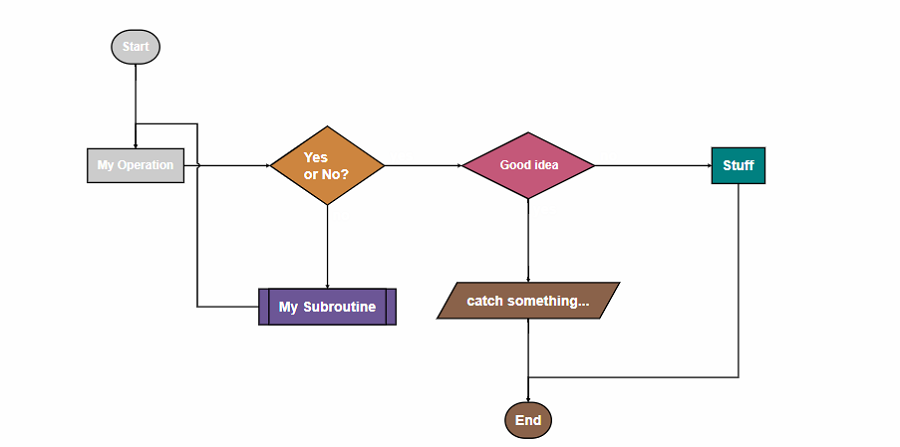

Forked from [nsdont/gitbook-plugin-new-flowchart](https://github.com/nsdont/gitbook-plugin-new-flowchart),to make sure we can add a custom style for the chart,also supports new version of `flowchart.js`(current version is `1.17.1`).

Fox Flowchart Plugin
==============

To use the plugin in your Gitbook project, add the plugin to the `book.json` file.

```
{
    "plugins": ["flowchart-fox"]
}
```

we can add custom style if necessary:

```javascript
pluginsConfig:{
    'flowchart':{        
        'x': 0,
        'y': 0,
        'width':1,
        'line-width': 1,
        'line-length': 50,
         'text-margin': 10       
    }
}
```

Then, to include a sequence diagram, just wrap your definition in a "sequence" code block. For example:

    ``` flow
    st=>start: Start|past:>http://www.google.com[blank]
    e=>end: End:>http://www.google.com
    op1=>operation: My Operation|past
    op2=>operation: Stuff|current
    sub1=>subroutine: My Subroutine|invalid
    cond=>condition: Yes
    or No?|approved:>http://www.google.com
    c2=>condition: Good idea|rejected
    io=>inputoutput: catch something...|request
    
    st->op1(right)->cond
    cond(yes, right)->c2
    cond(no)->sub1(left)->op1
    c2(yes)->io->e
    c2(no)->op2->e
    ```

Please reference the [flowchart.js](https://adrai.github.io/flowchart.js/) documentation for details on syntax.

Below is another example with more configuration items:

```javascript
'flowchart': {
    "arrow-end": "block",
    "element-color": "black",
    "fill": "white",
    "flowstate": {
        "approved": {
            "fill": "#58C4A3",
            "font-size": 12
        },
        "current": {
            "fill": "#008080",
            "font-color": "white",
            "font-weight": "bold"
        },
        "future": {
            "fill": "#8A624A"
        },
        "success": {
            "fill": "#0B6623",
            "font-color": "white",
            "font-weight": "bold"
        },
        "invalid": {
            "fill": "#6c5696"
        },
        "past": {
            "fill": "#CCCCCC",
            "font-size": 12
        },
        "select": {
            "fill": "#E1AD01",
            "font-size": 12
        },
        "rejected": {
            "fill": "#C45879",
            "font-size": 12
        },
        "request": {
            "fill": "#569656"
        },
        'yellowgreen': {
            "fill": "yellowgreen"
        },
        'failed': {
            "fill": "#800020"
        }
    },
    "font-color": "black",
    "font-size": 14,
    "line-color": "black",
    "line-length": 50,
    "line-width": 1.3,
    "scale": 21,
    "symbols": {
        "end": {
            "class": "end-element",
            "font-color": "white",
            "font-weight": "bold"
        },
        "start": {
            "fill": "#8c2106",
            "font-color": "white",
            "font-weight": "bold"
        }
    },
    "text-margin": 10,
    "width": 1,
    "x": 0,
    "y": 0,
    "yes-text": "是",
    "no-text": "否"
}
```

example screenshot:



## Reference
This project inspiration from [gmassanek/gitbook-plugin-js-sequence-diagram](https://github.com/gmassanek/gitbook-plugin-js-sequence-diagram),forked from [nsdont/gitbook-plugin-new-flowchart](https://github.com/nsdont/gitbook-plugin-new-flowchart)
